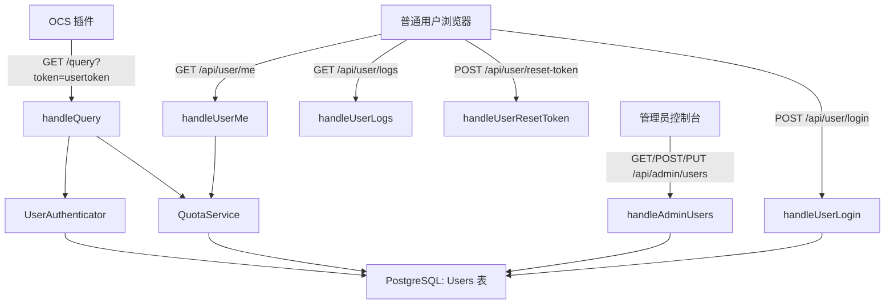
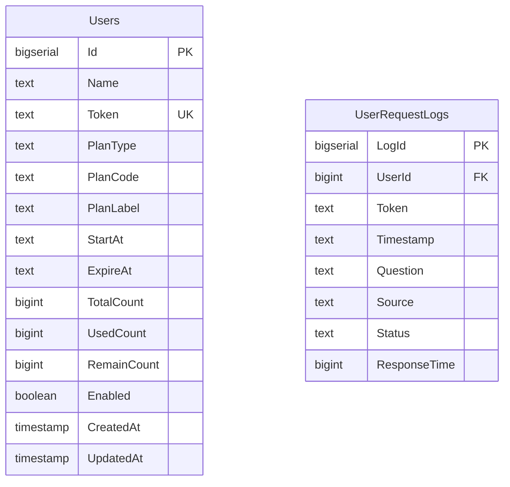

# 用户令牌与套餐体系设计

Feature Name: user-token-plans
Updated: 2026-10-05

## Description

为 nfentik-go 增加普通用户体系：管理员在控制台创建用户并生成唯一 `usertoken`，为用户选择时长套餐（包月/包季/半年/包年/无限）或次数套餐（固定总次数）。用户凭 `usertoken` 登录独立的用户页，查看剩余次数/有效期、复制包含自己令牌的 OCS 配置、查看自己的调用记录、重置自己的令牌，并在即将到期或用尽时收到提醒。`/query` 按令牌鉴权并在每次调用后扣减 1 次配额（命中题库或缓存同样扣减）。

现有系统已有单管理员 `adminToken` 模型（`internal/server/auth.go`），本设计在其之上扩展用户维度，保持管理员与普通用户权限隔离。

## Architecture



数据流说明：

- 管理员通过 `/api/admin/users` 完成用户增删改查、续费与套餐调整。
- 普通用户通过 `/api/user/*` 完成登录、查看套餐、查看记录、重置令牌，鉴权使用 `Authorization: Bearer <usertoken>`。
- `/query` 在鉴权阶段解析令牌，在查询完成后调用 `QuotaService.Consume` 扣减配额。

## Components and Interfaces

### 1. 数据层 `internal/store`

新增 `internal/store/users.go`，定义用户模型与仓储方法：

```go
type User struct {
    ID          int64  `json:"id"`
    Name        string `json:"name"`
    Token       string `json:"token"`
    PlanType    string `json:"plan_type"`     // duration | count
    PlanCode    string `json:"plan_code"`     // monthly|quarterly|half_year|yearly|unlimited|custom
    PlanLabel   string `json:"plan_label"`
    StartAt     string `json:"start_at"`
    ExpireAt    *string `json:"expire_at"`    // 时长套餐使用，无限与次数套餐为空
    TotalCount  *int64  `json:"total_count"`  // 次数套餐使用
    UsedCount   int64   `json:"used_count"`
    RemainCount *int64  `json:"remain_count"` // 次数套餐使用
    Enabled     bool    `json:"enabled"`
    CreatedAt   string  `json:"created_at"`
    UpdatedAt   string  `json:"updated_at"`
}
```

仓储方法：

- `CreateUser(u User) (User, error)`
- `GetUserByToken(token string) (*User, error)`
- `GetUserByID(id int64) (*User, error)`
- `ListUsers() ([]User, error)`
- `UpdateUser(u User) error`
- `DeleteUser(id int64) error`
- `ResetUserToken(id int64, token string) error`
- `ConsumeQuota(id int64) error`（次数套餐原子扣减：`UPDATE ... SET RemainCount = RemainCount - 1, UsedCount = UsedCount + 1 WHERE Id = $1 AND RemainCount > 0`）

### 2. 套餐定义 `internal/plan`

新增 `internal/plan/plan.go`，集中套餐元数据与计算逻辑，供后端与前端复用：

```go
type Kind int // KindDuration | KindCount
type Plan struct {
    Code  string
    Label string
    Kind  Kind
    Days  int  // 时长套餐天数，unlimited 为 0
    Unlimited bool
}
var Plans = []Plan{...} // monthly/quarterly/half_year/yearly/unlimited + count(custom)
func ExpireAt(start time.Time, p Plan) *time.Time
func Status(u store.User, now time.Time) string // active|expiring|expired|exhausted|disabled
```

套餐参数：

- 包月 monthly：30 天
- 包季 quarterly：90 天
- 半年 half_year：180 天
- 包年 yearly：365 天
- 无限 unlimited：无到期、无限制
- 次数 custom：需指定总次数

### 3. 鉴权 `internal/server/auth.go`

在现有 `handleLogin`（管理员）基础上，新增或扩展：

- `handleUserLogin`：`POST /api/user/login`，请求 `{token}`，解析到用户后返回 `{success, user}`。
- `userFromRequest(r) (*store.User, error)`：优先读取 `Authorization: Bearer <token>`，回退 `?token=`；查询 `Users` 表。
- `requireUser(next)`：用户端点鉴权中间件。
- `handleUserMe`：`GET /api/user/me`，返回当前用户套餐与状态。
- `handleUserResetToken`：`POST /api/user/reset-token`，生成新令牌。
- `handleUserLogs`：`GET /api/user/logs?page=&page_size=`，返回该用户调用记录。

管理员侧扩展 `handleAdmin` 的 `case "users":`：

- `GET /api/admin/users`：列出用户（含令牌、状态、剩余配额）。
- `POST /api/admin/users`：创建用户，body `{name, plan_code, total_count?, days?}`。
- `PUT /api/admin/users/{id}`：更新用户名/启用状态。
- `DELETE /api/admin/users/{id}`：删除用户。
- `POST /api/admin/users/{id}/renew`：续费，body `{plan_code, total_count?}`。
- `POST /api/admin/users/{id}/reset-token`：管理员重置用户令牌。

### 4. `/query` 鉴权与扣减 `internal/server/query.go`

在 `handleQuery` 中，于 `resolveQuery` 之前执行鉴权：

1. 解析 `usertoken`：
   - 若系统开启「仅令牌用户可用」且未携带令牌 → 拒绝。
   - 若携带令牌但无效 → 拒绝。
   - 若携带有效令牌 → 校验套餐状态（过期/用尽/禁用则拒绝）。
2. 通过后执行 `resolveQuery`。
3. 查询结束后（无论命中与否）调用 `ConsumeQuota` 扣减次数套餐 1 次；时长套餐不改变到期时间。
4. 扣减失败（并发导致余额不足）时，按「配额不足」处理并记录。

`QueryRequest` 增加令牌来源字段（从 query/body 或请求头解析，不进入 JSON 结构）；请求日志记录 `user_id` 以支持用户维度查询。

### 5. 前端

- 用户页模板 `web/templates/user.html` + `web/static/user.{css,js}`：登录界面、套餐卡片、剩余有效期/次数、提醒条、OCS 配置复制、调用记录表格、重置令牌。
- 管理员控制台 `console.html`/`console.js` 新增「用户管理」视图：用户列表、创建弹窗（含套餐选择与总次数输入）、续费、重置令牌、删除。
- 路由：`GET /user` 返回用户页；`/console` 保持管理员控制台。

## Data Models



- `Users`：核心用户表，`Token` 建唯一索引。
- `UserRequestLogs`：用户维度调用记录，便于用户页查询；由 `/query` 写入，记录 `user_id`、问题、来源（`bank`/`cache`/`ai`）、状态与耗时。为控制体量，仅保留最近 N 条（可配置或按天数清理）。

`AppSettings` 增加配置项：

- `usersEnabled`：是否启用用户体系。
- `requireTokenForQuery`：`/query` 是否强制要求令牌。
- `userLogRetentionDays`：用户调用记录保留天数。

## Correctness Properties

1. `usertoken` 全局唯一，生成后任意时刻可凭其定位唯一用户。
2. 次数套餐任何时刻满足 `UsedCount + RemainCount = TotalCount`。
3. 时长套餐在有效期内调用不改变 `ExpireAt`；无限套餐 `ExpireAt` 恒为空且不扣次数。
4. 配额不足或套餐过期的用户无法成功发起查询。
5. 用户端接口返回的数据始终属于请求令牌对应的用户。
6. 重置令牌后，旧令牌在任何接口上均无效。

## Error Handling

| 场景 | 处理 |
| --- | --- |
| 令牌缺失 | 返回 `{code:0, message:"缺少令牌"}`（HTTP 401） |
| 令牌无效 | 返回 `{code:0, message:"令牌无效"}`（HTTP 401） |
| 套餐过期 | 返回 `{code:0, message:"套餐已过期"}`（HTTP 403） |
| 次数用尽 | 返回 `{code:0, message:"次数已用尽"}`（HTTP 403） |
| 用户名重复 | 创建接口返回 `{success:false, message:"用户名已存在"}` |
| 未选择套餐 | 创建接口返回 `{success:false, message:"请选择套餐"}` |
| 总次数非法 | 创建接口返回 `{success:false, message:"总次数必须大于 0"}` |
| 名额并发扣减 | 扣减使用条件更新，失败按次数用尽处理 |
| 用户访问他人资源 | 返回 `{success:false, message:"无权访问"}`（HTTP 403） |

用户页对错误以提示条展示；OCS 查询失败时 OCS 插件按 `code:0` 与 `message` 展示。

## Test Strategy

- 单元测试 `internal/plan`：各套餐到期时间计算、状态判定（active/expiring/expired/exhausted/disabled）、无限套餐边界。
- 单元测试 `internal/store/users.go`：创建/查重、按令牌查询、重置令牌、`ConsumeQuota` 原子扣减与余额边界。
- 集成测试 `/query` 鉴权：缺令牌、无效令牌、过期、用尽、有效时长套餐、有效次数套餐、无限套餐各一条；验证扣减仅次数套餐生效。
- 集成测试用户端接口：登录、`/me`、`/logs` 仅返回本人数据、重置令牌后旧令牌失效。
- 前端手工验证：用户页提醒条临界值（剩余 ≤7 天、剩余 ≤20%）、OCS 配置复制含个人令牌、管理员创建/续费/重置流程。
- 安全测试：非本人令牌访问 `/api/user/*` 返回 403；令牌随机性与唯一性。

## References

[^1]: (File) - [auth.go](nfentik-go/internal/server/auth.go) 现有管理员登录与 requireAdmin 鉴权
[^2]: (File) - [admin.go](nfentik-go/internal/server/admin.go) 管理端路由 handleAdmin 与各接口
[^3]: (File) - [migrate.go](nfentik-go/internal/store/migrate.go) 版本化迁移与迁移项结构
[^4]: (File) - [config.go](nfentik-go/internal/config/config.go) AppSettings 与 MultiUser 现有结构
[^5]: (File) - [query.go](nfentik-go/internal/server/query.go) /query 处理与 bumpDailyRequest 计数
[^6]: (File) - [console.js](nfentik-go/web/static/console.js) 控制台 OCS 配置生成 ocsConfigObject
